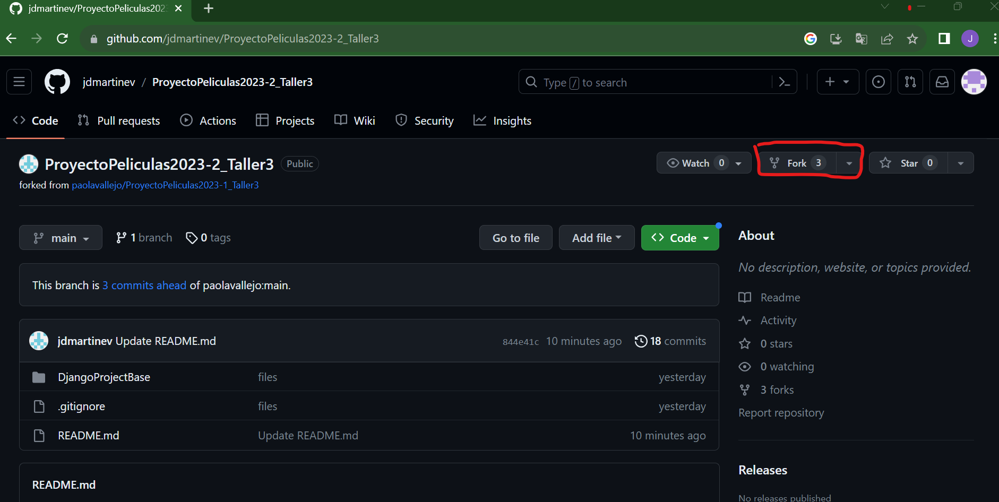
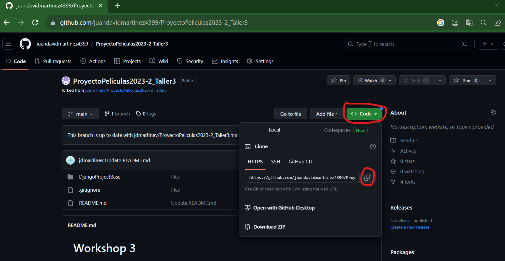
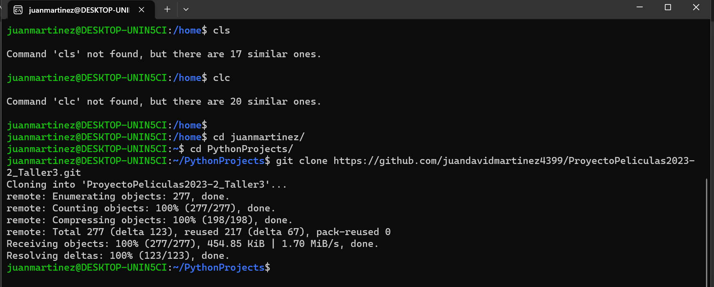

## Fork y clone

Haga un fork del proyecto, seleccionando la opción ``Fork``.

  

Seleccione el botón ``Create fork``.

  

Copie el enlace del git del repositorio, seleccionando el botón ``< > Code``, y luego, la opción ``copiar``.

  

Clone el repositorio en la máquina local, para esto ubíquese en la carpeta (local) en la que quedará almacenado el proyecto. Luego, use la instrucción ``git clone`` seguida del enlace git que acaba de copiar.

  

