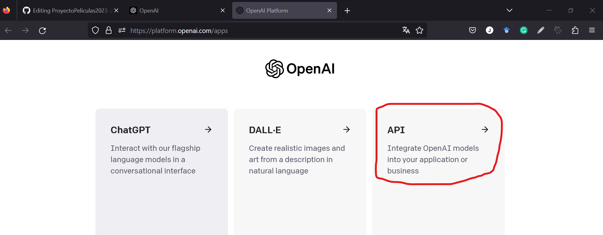
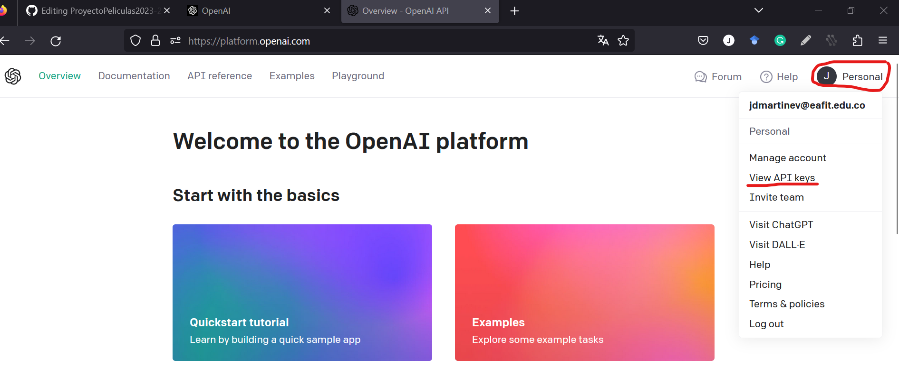
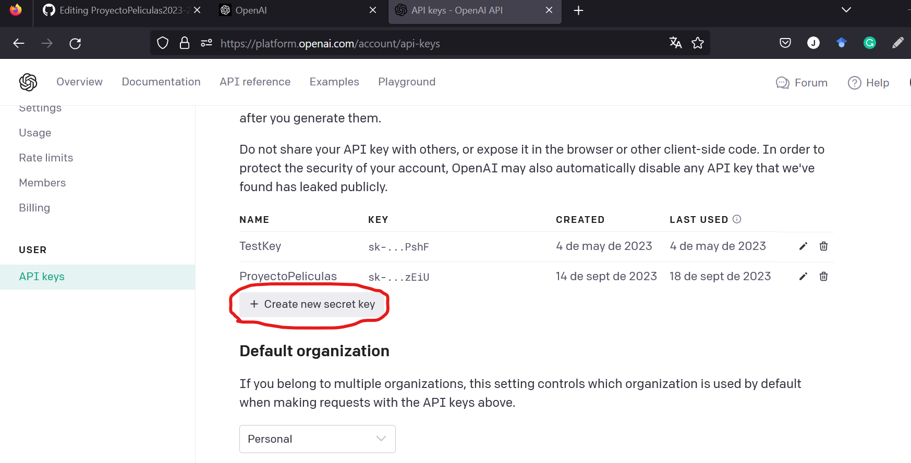
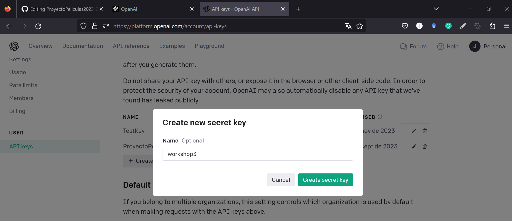
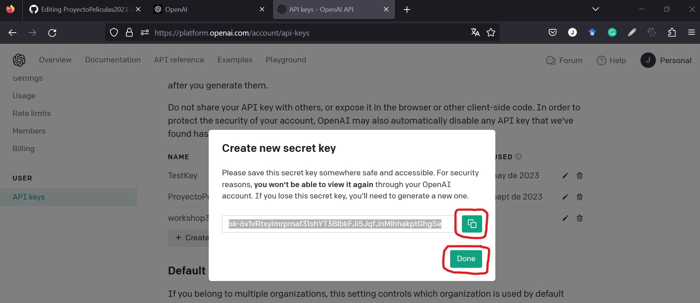
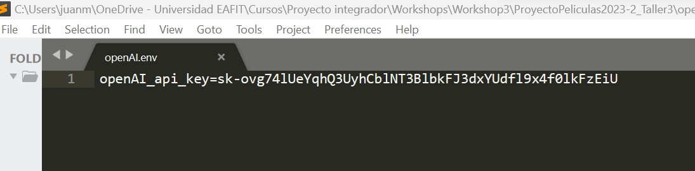
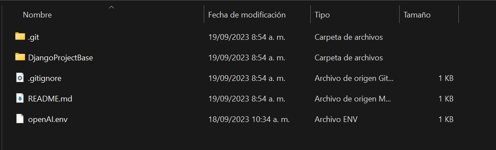
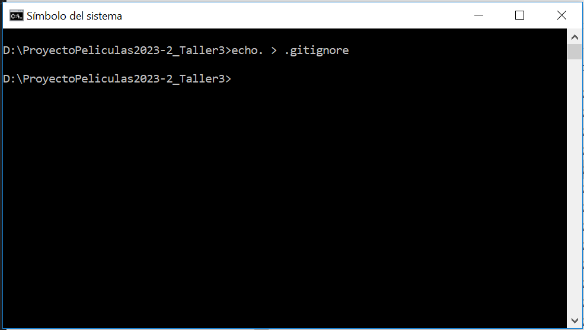
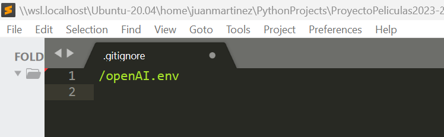

## Creación de la API key

Para crear la API key en openAI, debe ingresar con su cuenta a la página de openAI https://openai.com/ e ingresar al link API.

 <div align="center">
  <a>
    
  </a>
  </div>

Después, debe desplegar el menú ``Personal`` e ingresar a ``View API keys`` 

 <div align="center">
  <a>
    
  </a>
  </div>

  En esta nueva pantalla debe hacer clic en ``Create new secret key`` 

   <div align="center">
  <a>
    
  </a>
  </div>

  Allí debe ingresar un nombre para su API key, por ejemplo ``workshop3``
  
   <div align="center">
  <a>
    
  </a>
  </div>

Copie la API key y haga clic en ``Done``. Tenga en cuenta que después de cerrar esta ventana no tendrá de nuevo acceso a esta llave, por lo que debe almacenarla en algún documento.

   <div align="center">
  <a>
    
  </a>
  </div>

Almacene su API key en un documento ``.env``, por ejemplo ``openAI.env``. Esto lo puede hacer en un editor de texto como Sublime o VScode 

La estructura del archivo .env debe ser la siguiente:

````shell
openAI_api_key = skXXXXXXXXXXX
````

   <div align="center">
  <a>
    
  </a>
  </div>
  
Almacene este archivo en la carpeta raíz del proyecto

   <div align="center">
  <a>
    
  </a>
  </div>

Verifique que el archivo ``.gitignore`` está en la raíz del proyecto (__si el archivo ya está creado, puede omitir este paso__). Si no está creado, debe ubicarse en la raíz del proyecto y escribir la instrucción ``echo. > .gitignore``

 <div align="center">
  <a>
    
  </a>
 </div>

Abra con un editor de texto el archivo ``.gitignore`` que se encuentra en la raíz del proyecto. En este archivo se deben poner los nombres de los archivos que no queremos que se compartan en el repositorio en GitHub

   <div align="center">
  <a>
    
  </a>
  </div>

  De esta forma su API key estará segura y no tendrá que compartirla ni escribirla en ningún otro documento.
