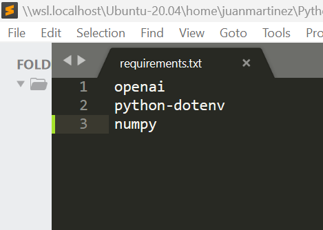
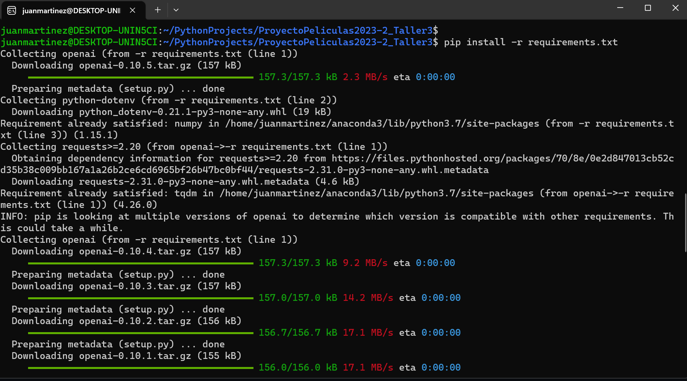

## Instalación de paquetes necesarios

Dado que este workshop es la continuación de los dos anteriores, se asumirá que ya deben tener instalado ``Python``, ``Django`` y ``Pillow``.

Adicional a estas librerías, vamos a instalar lo siguiente:

- ``openai``: Librería para acceder a modelos de inteligencia artificial
-  ``python-dotenv``: Manejo de api_keys de forma segura

Abra el archivo ``requirements.txt``. Notará que este archivo tiene la siguiente estructura:

 

  
  

En este archivo se deben listar todas las librerías necesarias para el funcionamiento del proyecto. Si se necesita una versión específica de alguna librería se debe especificar de la siguiente forma:

``numpy==1.20.1``

Por ahora, dado que no requerimos versiones específicas, se puede dejar el archivo como está.

Después, desde la consola ubicada en la carpeta donde se encuentra el archivo ``requirements.txt`` escriba lo siguiente:

``pip install -r requirements.txt``

 

  
  

Después de unos segundos la instalación debe quedar completa.
