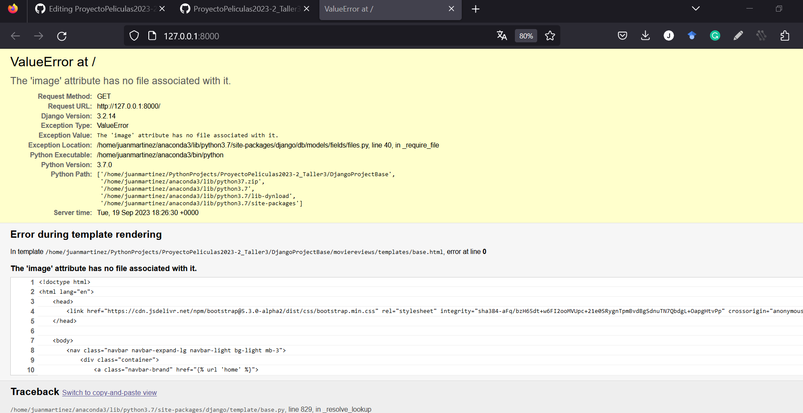

## Descripciones de películas

En esta etapa del proyecto se utilizará la API de openAI para generar descripciones de algunas películas que se agregarán a la base de datos.
Para esto, el archivo ``movie_titles.json`` que se encuentra en la raíz del proyecto, tiene una lista de películas a las que se le agregará información.

El archivo [movie_descriptions.py](movie_descriptions.py) muestra los pasos para utilizar la api de openai para obtener la descripción de las películas en la lista.
En este archivo se pueden ver dos funciones principales:

1. Creación de una función auxiliar para comunicarse con la api
2. Creación de un prompt que nos ayude a pedir de forma correcta la descripción de las películas.

Cuando ejecute el script, deberá ver en la consola algo de la siguiente forma:


Puede ver que se imprime el nombre de la película, el prompt completo y la descripción obtenida.

El archivo que se genera al correr todo el script (incluyendo las lineas comentadas) genera un archivo ``movie_descriptions.json``
que se va a utilizar para alimentar la base de datos de películas. Para esto nos vamos a dirigir a la carpeta ``DjangoProjectBase``. Asumiendo que la consola está en el directorio raíz del proyecto ``ProyectoPeliculas2023-2_Taller3``, en la consola escriba lo siguiente:

````shell
cd DjangoProjectBase
````
Si corre el servidor se dará cuenta que este es el proyecto que se creó en el workshop 2

````shell
python manage.py runserver
````


__Nota:__ Antes de continuar es necesario borrar la base de datos existente, hacer las migraciones, y crear de nuevo las credenciales de super-usuario.

Ahora dentro de la carpeta de la app movie debe crear una carpeta management y dentro de esta una carpeta commands. Después, debe crear el archivo add_descriptions_db.py.


Este archivo, que se utilizará para pasar la información del archivo .json a la base de datos de películas de la aplicación de Django. El contenido de este archivo se encuentra en [add_descriptions_db.py](aux_files/add_descriptions_db.py)

Para evitar un error dado que las películas no tienen imágenes, debe ir al archivo movie/models.py y modificar la línea 8 de la siguiente forma:

````python
image = models.ImageField(upload_to='movie/images/', default = 'movie/images/default.jpg')
````



Además, en la carpeta media/movie/images debe agregar la figura [default.jpg](aux_files/default.jpg). (puede ser cualquier figura).

Una vez haya copiado el contenido del archivo, en la consola va a ejecutar el siguiente comando:

````shell
python manage.py add_descriptions_db
````
Cuando termine de ejecutarse, debe ver un mensaje como el siguiente:


Puede ejecutar el servidor. Posiblemente tendrá un error dado que no todas las películas tienen imágenes.

Sin embargo puede ir a la página de administrador 127.0.0.1:8000/admin/ y cuando ingrese con las credenciales podrá observar que las películas quedaron correctamente almacenadas en la base de datos.


