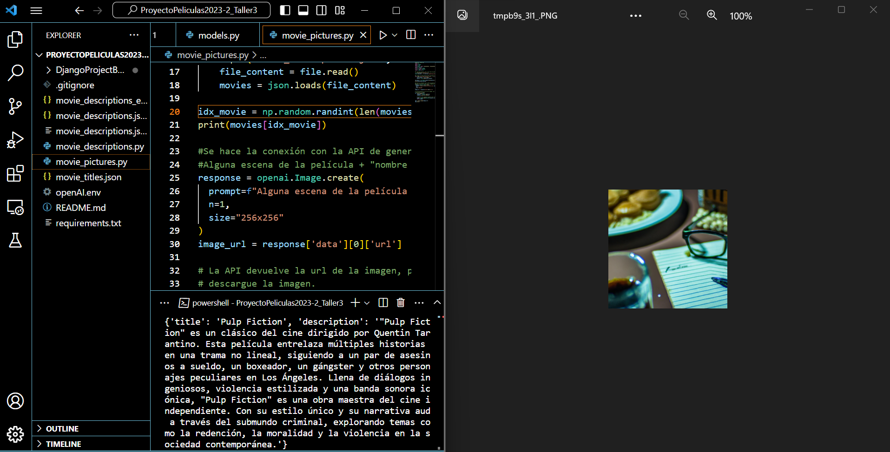
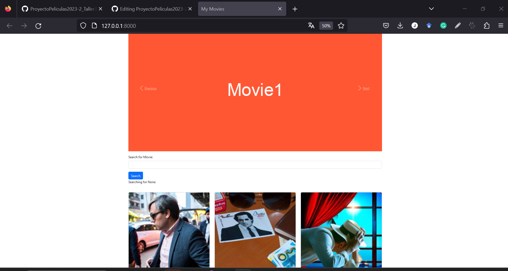

## Ilustraciones de películas

Ahora se utilizará la API de generación de imágenes de openAI para crear ilustraciones de las películas y modificar la imagen por defecto que se tiene en la base de datos.
Primero, se utilizará un script para entender el funcionamiento de la API y después se verá cómo se podría utilizar para modificar las imágenes de la base de datos.

En la consola va a volver al directorio raíz ``ProyectoPeliculas2023-2_Taller3``

````shell
cd ..
````

El script [movie_pictures.py](movie_pictures.py) muestra cómo conectarse a la API de generación de imágenes. En este caso, vamos a utilizar el título de la película como __prompt__, sin embargo, usted puede generar diferentes prompts para generar mejores ilustraciones, o utilizar la descripción de las películas.

Cuando ejecute este script, debe ver en la consola el nombre de la película, la descripción y en una ventana a parte la ilustración creada por la API



Se podría crear un script para crear y modificar las imágenes de la base de datos en la carpeta ``movie/management/commands``. Por ejemplo, si se ubica el archivo [add_images_db.py](aux_files/add_images_db.py) en la carpeta mencionada y se ejecuta el comando:

````shell
python manage.py add_images_db
````

Se estaría consultando la API de openAI de generación de imágenes para crear una imagen nueva para cada archivo de la base de datos. En este caso, por cuestión de tiempo, se omitirá este paso. Las imágenes para cada película se pueden descargar del siguiente link:

[images](https://drive.google.com/file/d/1-j6Q-AwrxO9q-BhPRHCp_MS2V6OYIhod/view?usp=sharing)

Esta carpeta se debe descomprimir y las imágenes se deben copiarlas en el path ``media/movie/images`` del proyecto ``DjangoProjectBase``

Ahora, se debe crear el archivo ``modify_image_paths_db.py`` en la carpeta ``movie/management/commands``. Con este archivo se modificará la imagen de cada película en la base de datos para que sea la ilustración generada por la API de generación de imágenes. Este archivo lo puede encontrar acá: [modify_image_paths_db.py](aux_files/modify_image_paths_db.py).

Una vez haya copiado el archivo en la ubicación mencionada, asegúrese de que la consola esté ubicada en ``DjangoProjectBase`` y ejecute el comando:

````shell
python manage.py modify_image_paths_db
````

Cuando ejecute el servidor podrá notar que la imagen de cada película corresponde a la ilustración creada por la API de generación de imágenes



