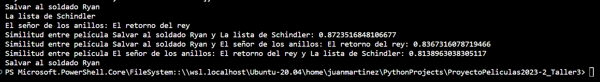
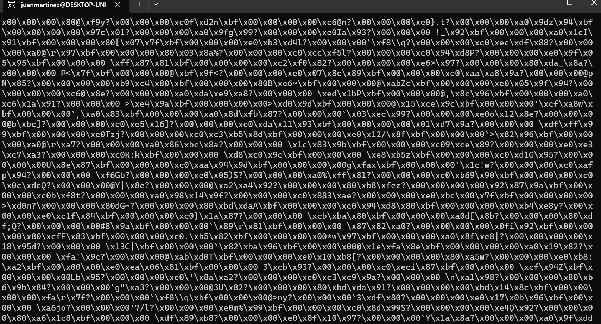
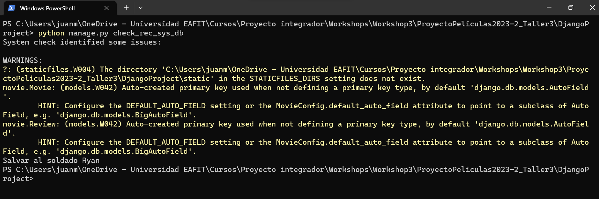

## Sistema de recomendación

Para el sistema de recomendación de películas se utilizará la API de generación de embeddings de openAI. De forma general, un embedding es una representación numérica de cualquier fenómeno, puede ser una  imagen, un video, o como en este caso, texto.


__Concepto Básico:__ Un embedding es básicamente una proyección de un objeto no vectorial en un espacio vectorial. En el contexto de PLN (procesamiento de lenguaje natural), los embeddings convierten palabras o frases en vectores de números reales.

__Utilidad:__ Estos vectores capturan la semántica y las relaciones contextuales entre las palabras. Palabras con significados similares o que a menudo aparecen en el mismo contexto tendrán embeddings similares, es decir, sus vectores estarán cerca en el espacio vectorial.

Se utilizará una medida de similitud muy conocida para calcular qué tan parecido es un prompt de entrada con las descripciones de las películas. 

La similitud de coseno mide el coseno del ángulo entre dos vectores, en este caso, dos embeddings. Es una métrica popular para calcular la similitud en espacios de alta dimensión como el de los embeddings.

Funciona de la siguiente manera:

__Fórmula:__ La similitud de coseno entre dos vectores AA y BB se calcula como el producto punto de los vectores dividido por el producto de sus magnitudes:

$similitud(A, B) = \frac{A \cdot B}{\|A\| \|B\|}$

Donde $A⋅B$ es el producto punto de los vectores y $∥A∥$ y $∥B∥$ son las magnitudes (o normas) de los vectores A y B respectivamente.

__Rango de Valores:__ La similitud de coseno produce un valor entre -1 y 1. Un valor de 1 indica que los vectores son idénticos en dirección, un valor de -1 indica que son opuestos y un valor de 0 indica que son ortogonales (no relacionados).

__Aplicación a Embeddings:__ Cuando se utiliza con embeddings, la similitud de coseno permite determinar qué tan similares son semánticamente dos palabras o frases. Si sus embeddings son cercanos en el espacio vectorial (es decir, tienen un ángulo pequeño entre ellos), su similitud de coseno será cercana a 1.

En resumen, la similitud de coseno compara la orientación de dos vectores en lugar de su magnitud, siendo una métrica esencial para evaluar la similitud semántica entre embeddings en el PLN.

El script [movie_recommendations.py](movie_recommendations.py) muestra cómo podemos utilizar los embeddings y la similitud de coseno para recomendar películas a partir de un prompt.

Al ejecutar el Script puede ver lo siguiente:



En este caso, los embeddings nos dicen que Salvar al soldado Ryan es más parecido a la Lista Schindler. Tiene sentido porque las dos películas son de la segunda guerra mundial. 

Además nos dicen que si quisiera ver una película de la segunda guerra mundial, debería ver Salvar al soldado Ryan.


Modifique el modelo Movie y agregue un campo adicional que sea el embedding de la descripción.

Un vector no se puede agregar directamente a la base de datos, por lo tanto, deberá crear un archivo binario que pueda almacenar como un campo de tipo __BinaryField__.

En el siguiente ejemplo puede ver cómo crear un archivo binario a partir de una lista y como recuperar la lista a partir del archivo binario, este ejemplo es ilustrativo, no es necesario ejecutarlo.

````python
from openai.embeddings_utils import get_embedding, cosine_similarity
import numpy as np

#Generar binario
desc = "película de la segunda guerra mundial"
emb = get_embedding(desc,engine='text-embedding-ada-002')

#Recuperar lista a partir del archivo binario
emb_binary = np.array(emb).tobytes()
rec_emb = list(np.frombuffer(emb_binary, dtype=arr.dtype))
````

El modelo Movie lo debe modificar de la siguiente forma:

````python
def get_default_array():
  default_arr = np.random.rand(1536)  # Adjust this to your desired default array
  return default_arr.tobytes()

class Movie(models.Model):
  title = models.CharField(max_length=100)
  description = models.CharField(max_length=250)
  emb = models.BinaryField(default=get_default_array())
  image = models.ImageField(upload_to='movie/images/', default = 'movie/images/default.jpg')
  url = models.URLField(blank=True)

  def __str__(self):
    return self.title
````

Note que está agregando un campo ``emb`` de tipo ``models.BinaryField``

Recuerde que cada que se hace una modificación al modelo se deben hacer las migraciones.

Finalmente, para modificar los items de la base de datos (en este caso agregar los embeddings), debe crear un archivo ``add_embeddings_db.py`` en la carpeta ``movie/management/command`` y ejecutarlo. 

````python
from django.core.management.base import BaseCommand
from movie.models import Movie
import json
import os
import numpy as np

class Command(BaseCommand):
    help = 'Modify path of images'

    def handle(self, *args, **kwargs):
        ##Código para leer los embeddings del archivo movie_descriptions_embeddings.json
        json_file_path = '../movie_descriptions_embeddings.json'
        # Load data from the JSON file
        with open(json_file_path, 'r') as file:
            movies = json.load(file)       
  
        for movie in movies:
            emb = movie['embedding']
            emb_binary = np.array(emb).tobytes()
            item = Movie.objects.filter(title = movie['title']).first()
            item.emb = emb_binary
            item.save()
        
        self.stdout.write(self.style.SUCCESS(f'Successfully updated item embeddings'))        
        
````

Para comprobar que los embeddings se crearon correctamente, debe crear un archivo ``check_embeddings_db.py`` en la ruta ``movie/management/command``. El archivo lo puede ver en [check_embeddings_db.py](aux_files/check_embeddings_db.py).
Cuando lo ejecute deberá ver en la consola algo de esta forma:



Finalmente, para comprobar que el sistema de recomendación funciona dentro de la aplicación, cree un archivo ``check_rec_sys_db.py`` en la ruta ``movie/management/command``. El archivo lo puede ver en [check_rec_sys_db.py](aux_files/check_rec_sys_db.py).

Cuando lo ejecute deberá ver en la consola algo de esta forma:




